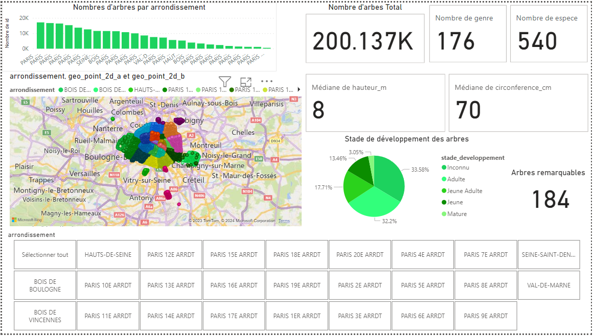
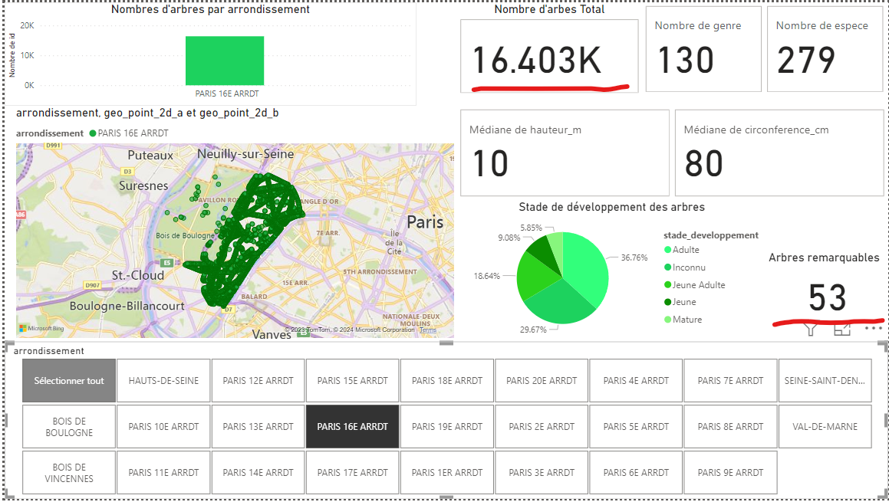
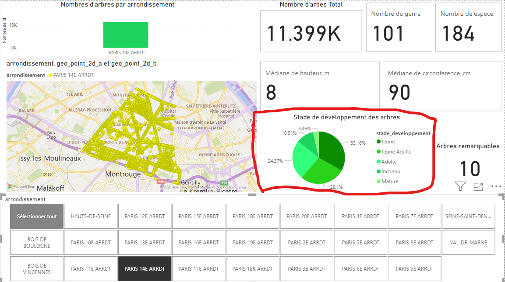
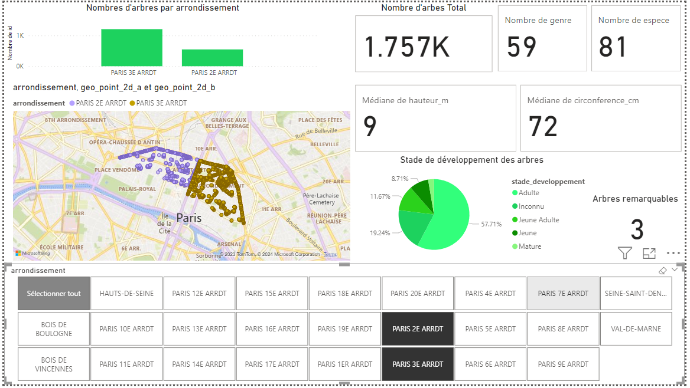

# Main points
The Power BI dashboard highlight the division of the trees in Paris by districts.  
The main KPI are the numbers of threes, their positions and I added informations about the trees. Among them, except the height of the threes, which can be really different in "Le bois de Vincenne", the others are purely informatives.  
The development of the trees, the remarquables trees and their heights could be interesting, but they are almost the same for each district (with some exceptions that could be noted).  

# First look at dashboard
We have the dashboard bellow, with the global KPIs and informations in Paris.  
At the bottom there is a multi selector of the districts.  
There are histogram, pie chart, KPIs and map chart. Each one of them are filtered by the selector.

# Selection
We can select one or many districts, which will change the charts and KPIs. It could be a very usefull tool to spot differences between districts.  
Here are few exemples.  
A selection that spotlight the lot of remarquable trees.  

A selection that spotlight the young trees.  

A multi selection

